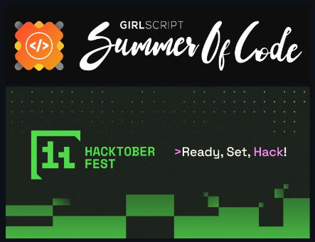

# 🎮 Collect Your GamingTools 🕹️
A <b> responsive and dynamic website </b> to showcase the best gaming accessories for every gamer!

<table align="center">
    <thead align="center">
        <tr border: 2px;>
            <td><b>🌟 Stars</b></td>
            <td><b>🍴 Forks</b></td>
            <td><b>🐛 Issues</b></td>
            <td><b>🔔 Open PRs</b></td>
            <td><b>🔕 Close PRs</b></td>
        </tr>
     </thead>
    <tbody>
         <tr>
            <td></td>
             <td></td>
            <td></td>
            <td></td>
           <td></td>
        </tr>
    </tbody>
</table>

## ✨ Features
🗂️ <b>Dynamic Navigation Menu</b>: Toggle visibility, designed for seamless use across all screen sizes.  

🛒 <b>Product Display</b>: View gaming products with prices, discounts, and a "Buy Now" option.

🌐 <b>Social Media Links</b>: Instant access to your favorite platforms like Facebook, Twitter, and Instagram. 

📱 <b>Responsive Design</b>: Enjoy smooth navigation whether you're on mobile, tablet, or desktop! 


## 💻 Technologies Used ( Frontend )
<p align="center">
  <a href="https://skillicons.dev">
    
  </a>
</p>

## 💻 Technologies Used ( Backend & Docker Functionality )

- 🟢 **Node.js** and **Express** for the backend
- 🍃 **MongoDB** for database storage
- 🐳 **Docker** for containerization

<p align="center">
    <a href="https://skillicons.dev">
        
    </a>
</p>

## ⚙️ Backend Setup
1. Clone the repository:
    ```bash
    git clone https://github.com/swaraj-das/Collect-your-GamingTools.git
    ```
2. Install dependencies:
    ```bash
    cd Collect-your-GamingTools
    npm install
    ```

3. Configure environment variables:
Create a .env file with:
```bash
MONGO_URI=your_mongodb_uri
JWT_SECRET=your_jwt_secret
PORT=5000
```

4. Start the server:
```bash
npm start
```

## 🐳 Docker
Build the Docker image:
```bash
docker build -t gamingtools-backend .
```

Run the container:
```bash
docker run -d -p 5000:5000 --env-file .env gamingtools-backend
```

## 🚀 Demo
#### Check out the live demo here ⬇️ : 

https://collect-your-gamingtools.netlify.app/

## 🛠️ Installation
#### To get started, simply clone the repository and open it in your browser:

1. Clone the repository:
    ```bash
    git clone https://github.com/swaraj-das/Collect-your-GamingTools.git
    ```
2. Navigate to the project directory:
    ```bash
    cd Collect-your-GamingTools
    ```
3. Open the `index.html` file in your browser:
    ```bash
    open index.html  # On macOS
    start index.html # On Windows
    xdg-open index.html # On Linux
    ```

<!--line-->


## 🤝 Contributing
Contributions are what make the **open-source** community such an amazing place to learn, inspire, and create. Here’s how you can contribute:
We welcome all contributions to improve **Collect Your GamingTools**! If you'd like to contribute, please follow the [Contributing.md](./Contributing.md) to get details on how to get started.

## 🎉 Proudly part of GSSoC-EXT'24 & Hacktoberfest 2024 ! 🚀✨
<div align="center">
  
</div>
<!--line-->


## 👥 Team

|  |  |
|:--:|:--:|
| **Swaraj Das** <br> <sub>Project Admin</sub> | **Anit Sarkar** <br> <sub>Maintainer</sub> |
| [](https://www.linkedin.com/in/swarajdas01/) | [](https://www.linkedin.com/in/anit-sarkar-11906a283/) |


## 🙌 Contributors


## 🎉 **Join us!**

Whether you’re contributing code, improving documentation, or suggesting new features, your involvement matters. We value contributions that help you learn and grow, not just for gaining points. 

All the Best! 💫 **Happy Coding!** 🍳


